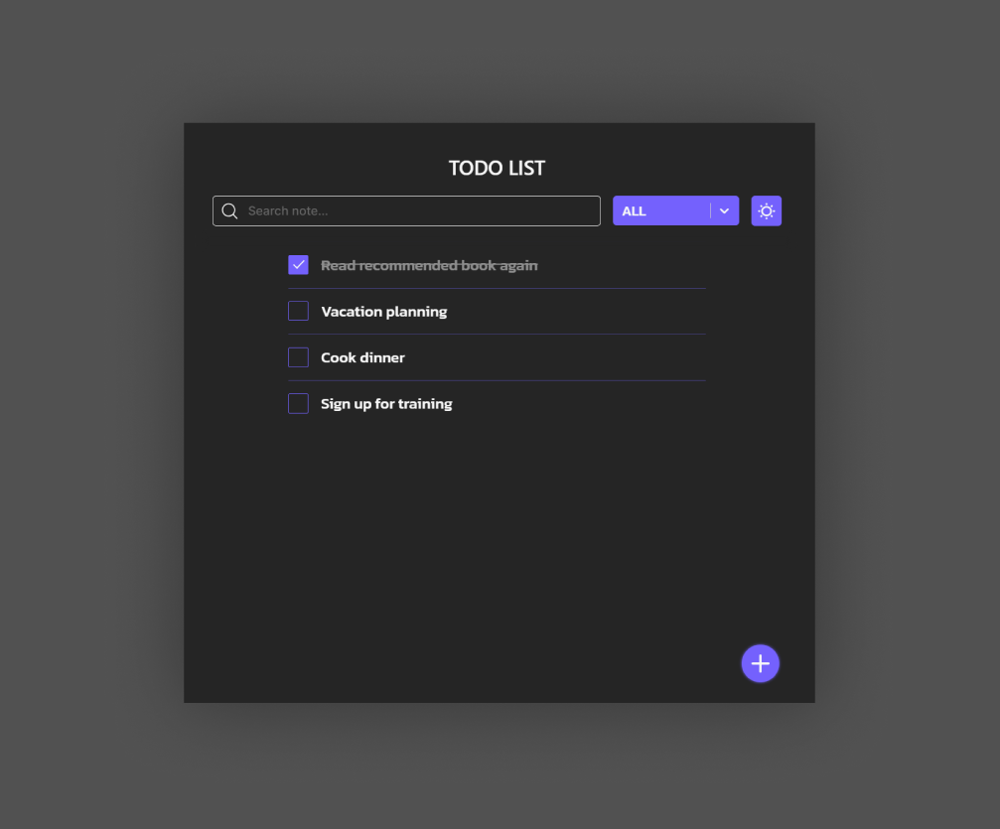

# Todo-App React with Typescript 


**Figma [Simple-ToDo-List-Design-(Community)](https://www.figma.com/design/Ri4XSAhKLfkkTEJEgqgQRa/Simple-ToDo-List-Design-(Community)?node-id=0-1&t=FSiluLPMTwgZJ1kE-0)**

**NOTE: Required install node/npm in your computer**

## Getting Start

#### To init app react
`npx create-react-app <app_name> --template typescript --use-npm`

**NOTE: override `<app_name>` to your project name**

#### To install [SASS](https://www.npmjs.com/package/sass) 
`npm install --save-dev sass`

#### To install [CSS MODULE](https://www.npmjs.com/package/typescript-plugin-css-modules) 
`npm install -D typescript-plugin-css-modules`

Once installed, add this plugin to your tsconfig.json:

```json
{
  "compilerOptions": {
    "plugins": [{ "name": "typescript-plugin-css-modules" }]
  }
}
```

## Resources

#### Font [KANIT](https://fonts.google.com/specimen/Kanit?preview.text=TODO%20LIST)
**NOTE: add import in your css style**
```css
@import url('https://fonts.googleapis.com/css2?family=Kanit:ital,wght@0,100;0,200;0,300;0,400;0,500;0,600;0,700;0,800;0,900;1,100;1,200;1,300;1,400;1,500;1,600;1,700;1,800;1,900&display=swap');
```

#### Icons [React-Icons](https://react-icons.github.io/react-icons/)
`npm install react-icons --save`
```typescript
import { FaBeer } from 'react-icons/fa';

class Question extends React.Component {
  render() {
    return <h3> Lets go for a <FaBeer />? </h3>
  }
}
```

#### Pallet Colors
`Black #252525`
`White #6C63FF`
`Purp le #F7F7F7`